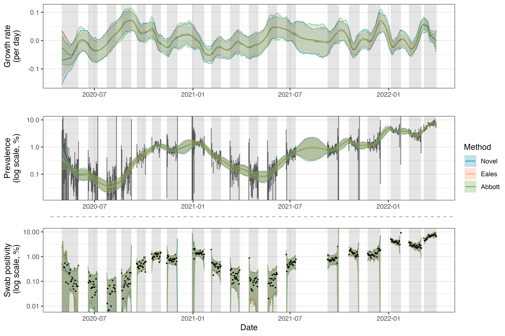

# Epidemic Survey Smoothing

Code to reproduce the results in *Bayesian modelling of repeated cross-sectional epidemic prevalence survey data*.

To get started quickly, we recommend looking at the Jupyter notebooks in ``/examples/``, which contains a start-to-finish worked example for each of the three methods considered.

The remainder of the repository is organized as follows:
- ``/src/``: Source code for the novel methods developed in the paper
- ``/OtherMethods/Eales/``: Source code for the modified implementations of the [Eales et al. (2022)](https://www.sciencedirect.com/science/article/pii/S1755436522000482) method
- ``/OtherMethods/Abbott/``: Source code for the modified implementations of the [Abbott and Funk (2023)](https://epiforecasts.io/inc2prev/paper) method
- ``/data/``: Data used in the paper (REACT-1 series and RT-PCR SARS-CoV-2 test sensitivity estimates
- ``/paper/``: Code to reproduce the figures and tables in the paper)

*Results from fitting the three methods to data from the REACT-1 prevalence survey.*